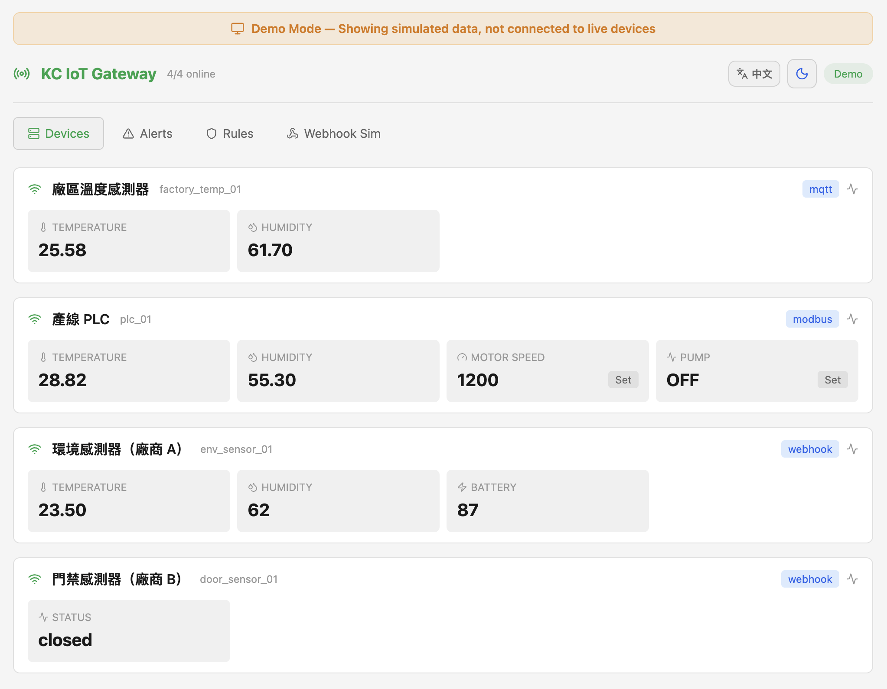
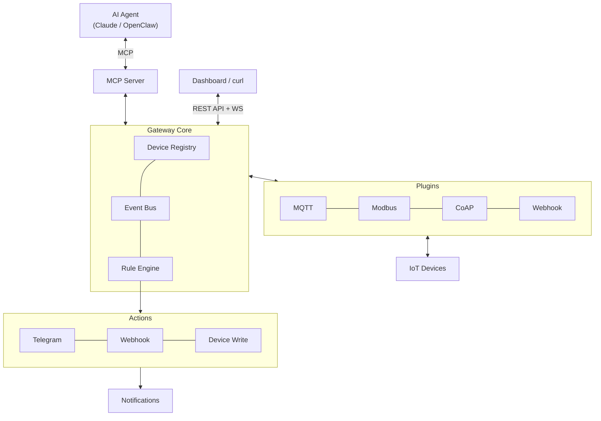

# "Read the factory temperature" -- IoT Gateway

[](LICENSE)
[](https://python.org)
[](https://fastapi.tiangolo.com)
[](https://modelcontextprotocol.io)

[正體中文](README_zh.md) | [Live Demo](https://kerberosclaw.github.io/kc_iot_gateway/)

So you've got a factory full of sensors speaking MQTT, PLCs that only understand Modbus, a few devices that insist on CoAP, and that one vendor who said "just POST us a webhook." Congratulations, you now need a gateway. This is that gateway -- a plugin-based IoT gateway that wrangles all of them behind a single REST API, so the rest of your stack doesn't have to care.

It also comes with a YAML-driven rule engine (because nobody wants to redeploy just to change a temperature threshold), a real-time web dashboard, an MCP server so AI agents can join the fun, and Docker Compose one-click deployment for people who value their sanity.

Born from the scar tissue of running a production IoT platform with 28 device plugins across 6 protocols and 10+ brands. This is the distilled version -- same architecture, fewer nightmares.



---

## What's In The Box

- **Multi-protocol support** -- MQTT, Modbus TCP, CoAP, Webhook -- all through one API. Your frontend dev doesn't need to know what Modbus is. (Lucky them.)
- **Plugin architecture** -- add a new protocol by dropping a single .py file. Zero core changes. Seriously.
- **YAML device profiles** -- define devices, fields, and data types in one config file instead of writing another adapter class
- **Rule engine** -- YAML-defined alert rules with cooldown, severity levels, and cross-device automation. Because alert storms at 3 AM build character, but only once.
- **Multi-channel alerts** -- Telegram, Webhook, and device-to-device control
- **Real-time dashboard** -- WebSocket-powered web UI with live device data and alert history. No React, no build step, just works.
- **Webhook simulator** -- built-in web UI to test webhook devices without reaching for curl or Postman
- **MCP server** -- let AI agents read/write devices via natural language. The future is here, whether we're ready or not.
- **AI agent skill** -- CLI wrapper for OpenClaw and other LLM agents
- **Docker-ready** -- `docker compose up -d` starts everything including simulators. Go get coffee.

---

## Quick Start

### Local Development

```bash
git clone https://github.com/KerberosClaw/kc_iot_gateway.git
cd kc_iot_gateway
uv sync

# Start simulators
uv run python simulators/modbus_simulator.py &

# Start gateway
uv run python -m src
# Dashboard: http://localhost:8000
```

### Docker Compose (The Easy Way)

```bash
docker compose up -d
open http://localhost:8000
```

This spins up the whole circus:
- Mosquitto MQTT broker (port 1883)
- MQTT sensor simulator
- Modbus PLC simulator (port 5020)
- Gateway + Dashboard (port 8000)

---

## Architecture



---

## Device Profile (YAML)

Tell the gateway about your devices in `devices.yaml`. No code required -- just describe what you've got and how to talk to it:

```yaml
plugins:
  mqtt_sensor:
    protocol: mqtt
    broker: localhost:1883
    devices:
      - id: factory_temp_01
        name: "Factory temperature sensor"
        topic: factory/sensor/temp_01
        fields:
          temperature: { path: "$.temp", unit: "°C", type: float }
          humidity: { path: "$.hum", unit: "%RH", type: float }

  modbus_plc:
    protocol: modbus
    host: localhost
    port: 5020
    slave_id: 1
    devices:
      - id: plc_01
        name: "Production PLC"
        registers:
          motor_speed: { address: 4, type: uint16, unit: "RPM", access: rw }
          temperature: { address: 0, type: float32, unit: "°C", access: ro }

  webhook_devices:
    protocol: webhook
    listen_path: /webhook
    devices:
      - id: env_sensor_01
        name: "Environment sensor (Vendor A)"
        identity:
          field: "$.device_id"
          value: "ENV-001"
        fields:
          temperature: { path: "$.data.temp", unit: "°C", type: float }
```

---

## Alert Rules (YAML)

Define your "please wake me up when something is on fire" rules in `rules.yaml`:

```yaml
rules:
  - name: high_temperature
    device: factory_temp_01
    condition:
      field: temperature
      operator: ">"
      threshold: 40
    severity: critical
    cooldown: 300
    actions:
      - type: telegram
        message: "[ALERT]{device_name} temperature {value}°C"

  - name: pump_auto_control
    device: plc_01
    condition:
      field: temperature
      operator: ">"
      threshold: 35
    actions:
      - type: device_write
        target_device: plc_01
        params: { pump_on: true }
```

Rules support:
- **Cooldown** -- because getting 47 identical Telegram messages in a row is not "monitoring," it's spam
- **Cross-device automation** -- sensor reads hot, pump turns on. No human in the loop, no human asleep at the desk.
- **Runtime modification** -- update rules via REST API without restart. Change thresholds in production without the cold sweat of redeployment.

---

## REST API

| Method | Endpoint | Description |
|--------|----------|-------------|
| GET | `/api/devices` | List all devices |
| GET | `/api/devices/{id}/read` | Read device data |
| POST | `/api/devices/{id}/write` | Control device |
| GET | `/api/devices/{id}/status` | Device online status |
| GET | `/api/rules` | List alert rules |
| POST | `/api/rules` | Create rule |
| PUT | `/api/rules/{name}` | Update rule |
| DELETE | `/api/rules/{name}` | Delete rule |
| PATCH | `/api/rules/{name}/toggle` | Enable/disable rule |
| GET | `/api/alerts` | Alert history |

---

## MCP Server

AI agents can boss around all your devices via MCP. They didn't ask for permission and honestly neither did we:

| Tool | Description |
|------|-------------|
| `list_devices` | List all devices with status |
| `read_device` | Read device data |
| `write_device` | Control a device |
| `device_status` | Check if device is online |
| `list_rules` | List alert rules |
| `list_alerts` | Query recent alerts |

---

## Project Structure

```
kc_iot_gateway/
├── src/
│   ├── gateway.py            # Core: startup, plugin loader, event bus
│   ├── plugin_base.py        # DevicePlugin ABC
│   ├── registry.py           # Device registry (in-memory state)
│   ├── api.py                # REST API (FastAPI)
│   ├── mcp_server.py         # MCP Server (FastMCP)
│   ├── rules.py              # Rule engine
│   ├── cooldown.py           # Cooldown manager
│   ├── db.py                 # SQLite (rules + alert history)
│   ├── plugins/
│   │   ├── mqtt_plugin.py
│   │   ├── modbus_plugin.py
│   │   ├── coap_plugin.py
│   │   └── webhook_plugin.py
│   └── actions/
│       ├── telegram.py
│       ├── webhook.py
│       ├── device_write.py
│       └── console.py
├── static/
│   └── index.html            # Dashboard + Webhook Simulator
├── simulators/
│   ├── mqtt_simulator.py
│   └── modbus_simulator.py
├── ai_agent_skill/           # AI agent CLI wrapper
├── tests/                    # Automated tests
├── docs/
│   └── DESIGN.md             # Design document
├── devices.yaml
├── rules.yaml
├── docker-compose.yml
└── Dockerfile
```

---

## Environment Variables

| Variable | Default | Description |
|----------|---------|-------------|
| `GATEWAY_HOST` | `0.0.0.0` | Gateway bind address |
| `GATEWAY_PORT` | `8000` | Gateway port |
| `MQTT_BROKER` | `localhost` | MQTT broker host |
| `MQTT_PORT` | `1883` | MQTT broker port |
| `TELEGRAM_BOT_TOKEN` | | Telegram bot token (optional) |
| `TELEGRAM_CHAT_ID` | | Telegram chat ID (optional) |

---

## TODO (A.K.A. "I'll Get To It")

- [ ] AND/OR compound rule conditions
- [ ] Plugin hot-reload without restart
