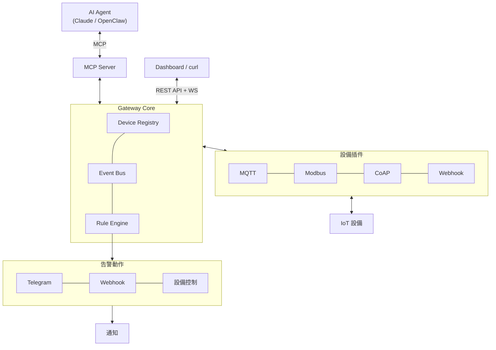

# 「讀取工廠溫度」-- IoT Gateway

[](LICENSE)
[](https://python.org)
[](https://fastapi.tiangolo.com)
[](https://modelcontextprotocol.io)

[English](README.md) | [Live Demo](https://kerberosclaw.github.io/kc_iot_gateway/)

工廠裡有一堆感測器講 MQTT，PLC 只聽得懂 Modbus，幾台設備堅持用 CoAP，還有那個廠商說「你開個 webhook 給我 POST 就好」。恭喜你，你需要一個 gateway。這就是那個 gateway -- Plugin 架構的 IoT Gateway，把所有設備統一在一個 REST API 後面，讓你的上層應用不用管底層到底在講什麼火星文。

內建 YAML 驅動的規則引擎（因為沒有人想為了改一個溫度閾值重新部署）、即時 Web Dashboard、MCP Server 讓 AI Agent 也能來湊熱鬧，還有 Docker Compose 一鍵部署給珍惜自己頭髮的工程師。

這套架構的設計理念來自實際生產環境的慘痛教訓：管理 28 種設備插件、6 種協議、10+ 品牌的 IoT 平台。本專案是精華濃縮版 -- 同樣的架構，少一點噩夢。


---

## 功能（也就是你不用自己寫的東西）

- **多協議支援** -- MQTT、Modbus TCP、CoAP、Webhook，統一 API 存取。你的前端工程師不需要知道 Modbus 是什麼。（他們真幸福。）
- **Plugin 架構** -- 新增協議只要加一個 .py 檔，核心不動。真的不動。
- **YAML 設備描述檔** -- 統一定義設備、欄位、資料型別，不用再寫一個 adapter class
- **規則引擎** -- YAML 定義告警規則，支援 cooldown、severity 分級、跨設備聯動。因為凌晨三點的告警風暴很鍛鍊心志，但一次就夠了。
- **多通道告警** -- Telegram、Webhook、設備控制聯動
- **即時 Dashboard** -- WebSocket 驅動，即時顯示設備數據和告警。沒有 React，沒有 build step，就是能跑。
- **Webhook 模擬器** -- Dashboard 內建 Web UI，不用開 curl 或 Postman
- **MCP Server** -- 讓 AI Agent 用自然語言操作設備。未來已經來了，不管我們準備好沒有。
- **AI Agent Skill** -- OpenClaw 等 LLM agent 的 CLI wrapper
- **Docker 一鍵啟動** -- `docker compose up -d` 啟動所有服務和模擬器。去泡杯咖啡吧。

---

> **安全聲明：** 本專案為 POC / 開發用途，設計用於受信任的內網環境。REST API、WebSocket、MQTT broker 和 webhook endpoint 不包含認證機制。請勿在未加裝額外安全措施的情況下將服務埠暴露到公網。

## 快速開始

### 本地開發

```bash
git clone https://github.com/KerberosClaw/kc_iot_gateway.git
cd kc_iot_gateway
uv sync

# 啟動模擬器
uv run python simulators/modbus_simulator.py &

# 啟動 Gateway
uv run python -m src
# Dashboard: http://localhost:8000
```

### Docker Compose（懶人首選）

```bash
docker compose up -d
open http://localhost:8000
```

一鍵啟動整個馬戲團：
- Mosquitto MQTT Broker（port 1883）
- MQTT 感測器模擬器
- Modbus PLC 模擬器（port 5020）
- Gateway + Dashboard（port 8000）

---

## 架構



---

## 設備描述檔（YAML）

在 `devices.yaml` 告訴 gateway 你有什麼設備。不用寫 code -- 描述一下你手上有什麼、怎麼跟它說話就好：

```yaml
plugins:
  mqtt_sensor:
    protocol: mqtt
    broker: localhost:1883
    devices:
      - id: factory_temp_01
        name: "廠區溫度感測器"
        topic: factory/sensor/temp_01
        fields:
          temperature: { path: "$.temp", unit: "°C", type: float }
          humidity: { path: "$.hum", unit: "%RH", type: float }

  modbus_plc:
    protocol: modbus
    host: localhost
    port: 5020
    slave_id: 1
    devices:
      - id: plc_01
        name: "產線 PLC"
        registers:
          motor_speed: { address: 4, type: uint16, unit: "RPM", access: rw }
          temperature: { address: 0, type: float32, unit: "°C", access: ro }

  webhook_devices:
    protocol: webhook
    listen_path: /webhook
    devices:
      - id: env_sensor_01
        name: "環境感測器（廠商 A）"
        identity:
          field: "$.device_id"
          value: "ENV-001"
        fields:
          temperature: { path: "$.data.temp", unit: "°C", type: float }
```

---

## 告警規則（YAML）

在 `rules.yaml` 定義你的「拜託出事的時候叫醒我」規則：

```yaml
rules:
  - name: high_temperature
    device: factory_temp_01
    condition:
      field: temperature
      operator: ">"
      threshold: 40
    severity: critical
    cooldown: 300
    actions:
      - type: telegram
        message: "[ALERT]{device_name} temperature {value}°C"

  - name: pump_auto_control
    device: plc_01
    condition:
      field: temperature
      operator: ">"
      threshold: 35
    actions:
      - type: device_write
        target_device: plc_01
        params: { pump_on: true }
```

規則支援：
- **Cooldown** -- 因為連續收到 47 條一模一樣的 Telegram 訊息不叫「監控」，叫「騷擾」
- **跨設備聯動** -- 感測器偵測到溫度過高，幫浦自動開啟。不需要人介入，也不需要人在值班室睡著。
- **即時修改** -- 透過 REST API 修改規則，不需重啟。在生產環境改閾值，不用經歷重新部署的冷汗。

---

## REST API

| Method | Endpoint | 說明 |
|--------|----------|------|
| GET | `/api/devices` | 列出所有設備 |
| GET | `/api/devices/{id}/read` | 讀取設備數據 |
| POST | `/api/devices/{id}/write` | 控制設備 |
| GET | `/api/devices/{id}/status` | 設備連線狀態 |
| GET | `/api/rules` | 列出告警規則 |
| POST | `/api/rules` | 新增規則 |
| PUT | `/api/rules/{name}` | 修改規則 |
| DELETE | `/api/rules/{name}` | 刪除規則 |
| PATCH | `/api/rules/{name}/toggle` | 啟用/停用規則 |
| GET | `/api/alerts` | 告警歷史 |

---

## MCP Server

AI Agent 透過 MCP 操作你的設備。它們沒有先問過你的意見，老實說我們也沒有：

| Tool | 說明 |
|------|------|
| `list_devices` | 列出所有設備及狀態 |
| `read_device` | 讀取設備數據 |
| `write_device` | 控制設備 |
| `device_status` | 檢查設備是否在線 |
| `list_rules` | 列出告警規則 |
| `list_alerts` | 查詢最近告警 |

---

## 專案結構

```
kc_iot_gateway/
├── src/
│   ├── gateway.py            # Core：啟動、Plugin 載入、Event Bus
│   ├── plugin_base.py        # DevicePlugin ABC
│   ├── registry.py           # Device Registry（in-memory 設備狀態）
│   ├── api.py                # REST API（FastAPI）
│   ├── mcp_server.py         # MCP Server（FastMCP）
│   ├── rules.py              # Rule Engine
│   ├── cooldown.py           # Cooldown Manager
│   ├── db.py                 # SQLite（規則 + 告警歷史）
│   ├── plugins/
│   │   ├── mqtt_plugin.py
│   │   ├── modbus_plugin.py
│   │   ├── coap_plugin.py
│   │   └── webhook_plugin.py
│   └── actions/
│       ├── telegram.py
│       ├── webhook.py
│       ├── device_write.py
│       └── console.py
├── static/
│   └── index.html            # Dashboard + Webhook Simulator
├── simulators/
│   ├── mqtt_simulator.py
│   └── modbus_simulator.py
├── ai_agent_skill/           # AI Agent CLI wrapper
├── tests/                    # 自動化測試
├── docs/
│   └── DESIGN.md             # 設計文件
├── devices.yaml
├── rules.yaml
├── docker-compose.yml
└── Dockerfile
```

---

## 環境變數

| 變數 | 預設值 | 說明 |
|------|--------|------|
| `GATEWAY_HOST` | `0.0.0.0` | Gateway 綁定位址 |
| `GATEWAY_PORT` | `8000` | Gateway 埠號 |
| `MQTT_BROKER` | `localhost` | MQTT Broker 位址 |
| `MQTT_PORT` | `1883` | MQTT Broker 埠號 |
| `TELEGRAM_BOT_TOKEN` | | Telegram Bot token（選填） |
| `TELEGRAM_CHAT_ID` | | Telegram Chat ID（選填） |

---
