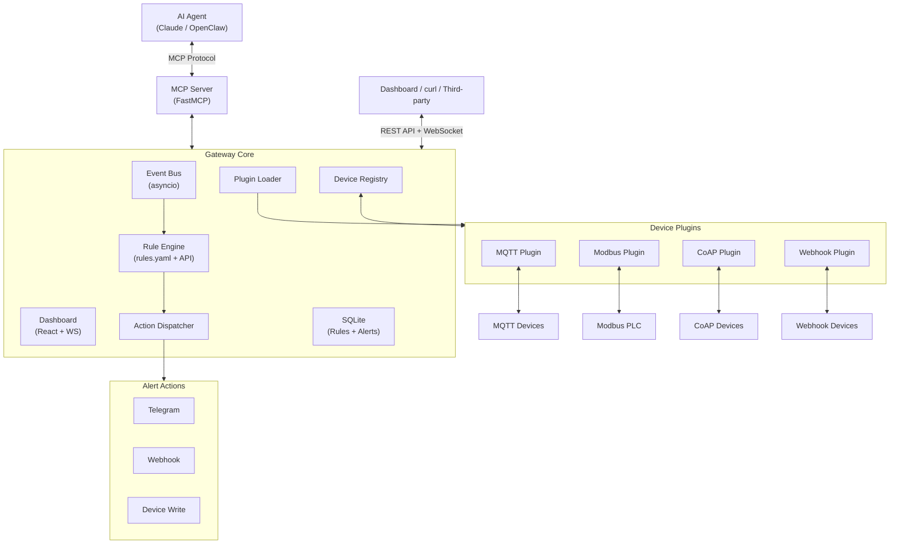
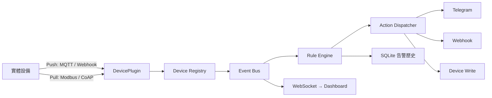

# kc_iot_gateway -- Design Document

> **English summary:** A lightweight, plugin-based IoT gateway that unifies device communication across multiple protocols (MQTT, Modbus TCP, CoAP, Webhook) behind a single REST API and MCP interface. Features a YAML-driven rule engine for alerting (Telegram, Webhook) with cooldown and cross-device automation, a real-time web dashboard with built-in webhook simulator, device simulators for all protocols, an MCP Server for AI agent integration, and Docker Compose one-click deployment. Born from the battle scars of running a production IoT platform that managed 28 device plugins across 6 protocols and 10+ brands.

---

# 設計文件

## 概觀

一個輕量級、Plugin 架構的 IoT Gateway，把一堆講不同語言的設備統一在一個 REST API 和 MCP 介面後面。讓上層應用不用關心底層到底是 MQTT 還是 Modbus，歲月靜好。

核心理念來自實際生產環境的血淚經驗：管理 28 種設備插件、6 種協議、10+ 品牌的 IoT 平台。本專案是該架構的精華濃縮版 -- 去掉企業級的複雜度，保留設計本質。換句話說，把痛苦的部分學起來，但不帶回家。

### 解決什麼問題？

客戶永遠在問那句經典台詞：「下個月要加一個新品牌的感測器，你們能接嗎？」

如果 gateway 是鐵板一塊，每加一個設備就要改核心、重新部署、然後雙手合十祈禱不會影響其他設備。28 個設備插件，你真的不能這樣搞。問我怎麼知道的？別問。

所以 gateway 的核心只做三件事：**收、轉、發**。設備怎麼溝通，全部封裝在 plugin 裡。新設備上線 = 丟一個 plugin 進去，核心不動。這不是什麼高深的設計模式，就是被需求逼出來的生存智慧。

---

## 架構



---

## Plugin 系統

### 設計原則

Plugin 介面越小，越好寫，生態越容易長。這個道理聽起來很簡單，但在會議室裡每次都要跟「那我們再多加一個 method 好了」奮戰半小時。

設備有兩種通訊模式：
- **Pull（拉）**-- Gateway 主動去敲設備的門要數據（Modbus polling、CoAP GET）
- **Push（推）**-- 設備自己把數據丟上來（MQTT subscribe、Webhook POST）

Plugin 介面同時支援兩種模式。你的設備愛用哪種就用哪種，我們不挑：

```python
class DevicePlugin(ABC):
    """設備插件抽象基類"""

    # --- 連線管理 ---
    @abstractmethod
    async def connect(self, config: dict) -> bool:
        """連線到設備或 broker"""

    # --- Pull 模式 ---
    @abstractmethod
    async def read(self, device_id: str, params: dict) -> dict:
        """主動讀取設備數據（Modbus、CoAP GET）"""

    # --- Push 模式 ---
    @abstractmethod
    async def start_listening(self, callback: Callable) -> None:
        """啟動監聽，收到數據時呼叫 callback(device_id, data)
        MQTT: subscribe topics
        Webhook: 註冊 HTTP endpoint
        不支援 push 的 plugin 留空即可"""

    @abstractmethod
    async def stop_listening(self) -> None:
        """停止監聯"""

    # --- 下行控制 ---
    @abstractmethod
    async def write(self, device_id: str, params: dict) -> dict:
        """控制設備（下行指令）"""

    # --- 設備發現 ---
    @abstractmethod
    async def discover(self) -> list[dict]:
        """自動發現設備（可選，回傳空 list 即可）"""
```

### 四個內建 Plugin

| Plugin | 協議 | 模式 | 上行（讀） | 下行（寫） |
|--------|------|------|----------|----------|
| MqttPlugin | MQTT | Push | subscribe topic，解析 JSON | publish 到 cmd topic |
| ModbusPlugin | Modbus TCP | Pull | read holding/input registers | write registers/coils |
| CoapPlugin | CoAP | Pull | GET resource | PUT resource |
| WebhookPlugin | HTTP | Push | 接收設備 POST，解析 payload | （無，或呼叫設備 API） |

### Plugin 與 Gateway 的互動

```
Gateway 啟動
  → 掃描 plugins/ 目錄，載入所有 DevicePlugin 子類
  → 對每個 plugin:
      → connect(config)
      → start_listening(callback)    # Push 型開始收數據
  → 等待 API 呼叫
      → read()                      # Pull 型走這條
      → write()                     # 兩種都支援
```

Push 進來的數據透過 callback 送入 Device Registry, 然後走 Event Bus, 再到 Rule Engine -- 跟 Pull 讀取的後續流程完全一樣。兩條路進來，一條路出去。乾淨。

### Plugin 載入機制

生產系統用 Java Reflection 掃描 classpath（很企業級，也很痛苦）。本專案簡化為目錄掃描，因為 Python 可以這樣任性：

```
src/plugins/
├── mqtt_plugin.py       → MqttPlugin
├── modbus_plugin.py     → ModbusPlugin
├── coap_plugin.py       → CoapPlugin
└── webhook_plugin.py    → WebhookPlugin
```

Gateway 啟動時掃描 `plugins/` 目錄，每個模組匯出一個繼承 `DevicePlugin` 的 class，自動註冊。新增協議 = 新增一個 .py 檔，核心不動。就這樣。沒有 XML 配置地獄，沒有 classpath 除錯噩夢。

---

## 設備描述檔 -- devices.yaml

統一描述所有設備，不管什麼協議。用 YAML 寫，因為生活已經夠苦了，不需要再用 XML：

```yaml
plugins:
  mqtt_sensor:
    protocol: mqtt
    broker: mosquitto:1883
    devices:
      - id: factory_temp_01
        name: "廠區溫度感測器"
        topic: factory/sensor/temp_01
        data_format: json
        fields:
          temperature: { path: "$.temp", unit: "°C", type: float }
          humidity: { path: "$.hum", unit: "%RH", type: float }

      - id: factory_temp_02
        name: "倉庫溫度感測器"
        topic: factory/sensor/temp_02
        data_format: json
        fields:
          temperature: { path: "$.temp", unit: "°C", type: float }

  modbus_plc:
    protocol: modbus
    host: modbus-simulator:5020
    slave_id: 1
    byte_order: big
    devices:
      - id: plc_01
        name: "產線 PLC"
        registers:
          motor_speed: { address: 4, type: uint16, unit: "RPM", access: rw }
          temperature: { address: 0, type: float32, unit: "°C", access: ro }
          pump_on: { address: 0, fc: 1, type: bool, access: rw }

  coap_light:
    protocol: coap
    devices:
      - id: light_01
        name: "廠區照明"
        host: coap-simulator:5683
        resources:
          brightness: { path: "/light/brightness", type: int, unit: "%", access: rw }
          power: { path: "/light/power", type: bool, access: rw }

  webhook_devices:
    protocol: webhook
    listen_path: /webhook
    devices:
      - id: env_sensor_01
        name: "環境感測器（廠商 A）"
        identity:
          field: "$.device_id"
          value: "ENV-001"
        fields:
          temperature: { path: "$.data.temp", unit: "°C", type: float }
          humidity: { path: "$.data.hum", unit: "%RH", type: float }
          battery: { path: "$.data.bat", unit: "%", type: int }

      - id: door_sensor_01
        name: "門禁感測器（廠商 B）"
        identity:
          field: "$.sn"
          value: "DOOR-2F-01"
        fields:
          status: { path: "$.event.type", type: string }
```

### Webhook Plugin 的運作方式

每家設備商的 payload 格式不同 -- 這大概是 IoT 界唯一不變的真理。所以 Webhook Plugin 用 YAML 定義解析規則，而不是為每家廠商寫一堆 if-else：

```
設備 POST /webhook
  → WebhookPlugin 收到 request body
    → 用 identity.field 從 JSON 中取值，比對是哪台設備
      → 用 fields[].path 從 JSON 中提取數據
        → callback(device_id, parsed_data)
          → 進入標準上行流程
```

不需要為每家設備商寫 code，只需要加一段 YAML。你的週末因此得救。

---

## 統一 REST API

不管底層是 MQTT、Modbus、CoAP 還是 Webhook，對外的 API 長一樣。這就是 gateway 存在的全部意義 -- 讓上層不用關心底層的混亂：

### 設備 API

```
GET  /api/devices                              → 列出所有設備
GET  /api/devices/{device_id}                  → 設備詳情 + 最新數值
GET  /api/devices/{device_id}/read             → 即時讀取
POST /api/devices/{device_id}/write            → 控制設備
GET  /api/devices/{device_id}/status           → 連線狀態
```

### 規則 API

```
GET    /api/rules                              → 列出所有規則
POST   /api/rules                              → 新增規則
PUT    /api/rules/{rule_name}                  → 修改規則
DELETE /api/rules/{rule_name}                  → 刪除規則
PATCH  /api/rules/{rule_name}/toggle           → 啟用/停用規則
```

### 告警 API

```
GET  /api/alerts                               → 告警歷史
GET  /api/alerts?severity=critical             → 依等級篩選
```

### Dashboard + WebSocket

```
GET  /                                         → Web Dashboard（即時監控頁面）
WS   /ws                                       → WebSocket 即時數據推送
```

### 範例

```bash
# 讀 MQTT 感測器
GET /api/devices/factory_temp_01/read
→ {"device": "factory_temp_01", "temperature": 25.3, "humidity": 62.1}

# 控制 PLC 馬達
POST /api/devices/plc_01/write
  {"motor_speed": 1500}
→ {"status": "ok", "written": {"motor_speed": 1500}}

# 修改告警規則閾值
PUT /api/rules/high_temperature
  {"condition": {"field": "temperature", "operator": ">", "threshold": 45}}
→ {"status": "ok", "rule": "high_temperature", "updated": true}
```

上層的 AI Agent 或 Dashboard 不需要知道底層是 MQTT 還是 Modbus。透過 REST API 或 MCP，用語義化的方式操作設備即可。這就是 Protocol Adapter Pattern -- 聽起來很厲害，其實就是「多加一層」的花式說法。

---

## MCP Server

Gateway 內建 MCP Server（基於 FastMCP），讓 AI Agent 直接用自然語言操作所有設備。是的，我們讓 AI 控制工廠設備了。我確定這不會有任何問題。

### MCP Tools

| Tool | 說明 |
|------|------|
| `list_devices` | 列出所有設備及其協議、連線狀態 |
| `read_device` | 讀取指定設備的數據 |
| `write_device` | 控制指定設備 |
| `device_status` | 檢查設備是否在線 |
| `list_rules` | 列出所有告警規則 |
| `list_alerts` | 查詢最近告警 |

### AI Agent 使用範例

```
User: "工廠溫度多少？"
Agent → read_device(device="factory_temp_01", register="temperature")
     → "目前廠區溫度 26.3°C，濕度 58.2%RH"

User: "把馬達調到 1500 RPM"
Agent → write_device(device="plc_01", params={"motor_speed": 1500})
     → "已將 plc_01 的馬達轉速設定為 1500 RPM"

User: "哪些設備離線了？"
Agent → list_devices()
     → "所有設備都在線。factory_temp_01 (MQTT), plc_01 (Modbus), light_01 (CoAP)"
```

MCP Server 底層呼叫的是 Gateway Core 的 Device Registry 和 Plugin，跟 REST API 共用同一套邏輯。不是另起爐灶，是同一個爐灶開兩個窗口。

### AI Agent Skill

提供 AI Agent（OpenClaw 等）的 CLI wrapper script，因為有時候打指令比寫 JSON 快：

```bash
iot list                              # list_devices
iot status factory_temp_01            # device_status
iot read factory_temp_01 temperature  # read_device
iot write plc_01 motor_speed 1500     # write_device
iot alerts                            # list_alerts
iot rules                             # list_rules
```

---

## 資料流

### 上行（設備 → 系統）-- 數據怎麼進來的



### 下行（系統 → 設備）-- 指令怎麼出去的


Closed-loop：下行控制完，設備回報會自動觸發上行流程，確保系統中的數值是設備的真實狀態。不是你以為你設了 1500 RPM 就是 1500 RPM -- 要等設備親口說「對，我現在是 1500 RPM」才算數。這是在生產環境被教訓出來的。

---

## 規則引擎 + 告警

### 規則來源

規則有兩種方式進來，因為工程師需要彈性，而 PM 需要安全感：

1. **啟動時** -- 從 `rules.yaml` 載入預設規則，存入 SQLite。版本控制友善。
2. **運行時** -- 透過 REST API 或 Dashboard 新增/修改/刪除規則，即時生效，不需要重啟。老闆站在你背後說「把閾值改成 45 度」的時候很好用。

### rules.yaml 範例

```yaml
rules:
  - name: high_temperature
    description: "廠區溫度過高"
    device: factory_temp_01
    condition:
      field: temperature
      operator: ">"
      threshold: 40
    severity: critical
    cooldown: 300
    actions:
      - type: telegram
        message: "[ALERT]{device_name} temperature {value}°C exceeds threshold"

  - name: device_offline
    description: "設備離線偵測"
    device: "*"
    condition:
      type: offline
      timeout: 300
    severity: warning
    cooldown: 600
    actions:
      - type: webhook
        url: http://alerting-system/api/alerts

  - name: pump_auto_control
    description: "溫度過高自動開泵"
    device: factory_temp_01
    condition:
      field: temperature
      operator: ">"
      threshold: 35
    severity: info
    cooldown: 60
    actions:
      - type: device_write
        target_device: plc_01
        params: { pump_on: true }
```

### 設計重點

- **cooldown** -- 生產環境最怕告警風暴。同一規則在 cooldown 時間內只觸發一次。你的手機會感謝你。
- **severity 分級** -- critical / warning / info。凌晨三點只收 critical，其他的明天早上再說。
- **device_write action** -- 不只是通知你「溫度太高了」然後袖手旁觀，還能自動開泵降溫。有手有腳的告警系統。
- **萬用匹配** -- `device: "*"` 套用到所有設備。偷懶的最高境界是寫成功能。
- **即時修改** -- 透過 API 或 Dashboard 修改規則，不需重啟 gateway。因為重啟 = 那幾秒鐘你是瞎的。

### 告警通道

| 通道 | 實作方式 | 設定 |
|------|---------|------|
| Telegram Bot | HTTP POST to Telegram Bot API | bot token + chat_id 在 .env |
| Webhook | HTTP POST JSON | 目標 URL 在 rules.yaml |
| Console | stdout log | 開發用，預設啟用 |
| device_write | 呼叫 Plugin.write() | target_device + params 在 rules.yaml |

---

## Web Dashboard

單頁 HTML + WebSocket，嵌在 FastAPI 裡，不需要任何前端框架。沒有 node_modules，沒有 webpack，沒有「你的 npm 版本不對」。就一個 HTML 檔，能跑就贏。

### 功能

| 區塊 | 內容 |
|------|------|
| Devices | 所有設備即時數值 + 連線狀態（綠燈/紅燈），WebSocket 自動更新 |
| Alerts | 最近告警歷史，依 severity 標色（紅/黃/藍） |
| Rules | 規則列表 + 啟用/停用開關 + 編輯閾值 |
| Webhook Simulator | 模擬 Webhook 設備發送數據（見下方說明） |

### 技術方案

- `static/index.html` -- 純 HTML + CSS + vanilla JavaScript。是的，vanilla JS。它還活著，而且過得很好。
- WebSocket `/ws` -- Gateway 推送即時設備數據和告警事件
- Rules 區塊透過 REST API CRUD 規則

### 啟動方式

```bash
docker compose up -d
open http://localhost:8000
```

啟動後，Dashboard 即時顯示所有設備的數據變化和告警事件。不用額外設定，不用另開 terminal，打開瀏覽器就能看。

---

## 設備模擬器

內建四種設備模擬方式，`docker compose up` 後所有模擬器自動啟動。因為沒有人手邊隨時有一台 PLC 可以測試（如果你有，我很羨慕）：

| 模擬器 | 類型 | 行為 |
|--------|------|------|
| MQTT Simulator | 獨立 service | 每 2 秒發布溫濕度 JSON 到 mosquitto（正弦波 + 隨機波動） |
| Modbus Simulator | 獨立 service | Modbus TCP server，溫度正弦波、馬達/幫浦保持寫入值 |
| CoAP Simulator | 獨立 service | CoAP server，支援 GET/PUT brightness 和 power |
| Webhook Simulator | Dashboard 內建 | Web UI 模擬 Webhook 設備發送數據 |

### Webhook Simulator

整合在 Dashboard 的 Webhook Simulator 頁籤中，提供 Web UI 讓你假裝自己是一台設備：

- 下拉選擇設備（env_sensor_01 / door_sensor_01）
- 根據設備的 fields 定義自動產生對應的輸入欄位和 slider
- 點擊 Send 後，從瀏覽器直接 POST 到 `/webhook` endpoint
- Dashboard 即時顯示收到的數據和觸發的告警

這樣不需要使用 curl 或外部工具，直接在瀏覽器中完成 Webhook 的完整測試流程。連 Postman 都不用開。

---

## 儲存

| 用途 | 方案 | 理由 |
|------|------|------|
| 設備最新值 | in-memory（Device Registry） | 讀取頻繁，毫秒級回應 |
| 設備設定 | devices.yaml | 靜態設定，不需要 DB |
| 告警規則 | SQLite（啟動時從 rules.yaml 載入） | 支援 API 動態修改 |
| 告警歷史 | SQLite | 零設定、零依賴 |
| cooldown 狀態 | in-memory dict | 單 process，不需要 Redis |

生產環境換成 MySQL/PostgreSQL + Redis 只需要改 DAO adapter，架構層是抽象的。但說真的，SQLite 能撐到的規模比大部分人想像的大得多。先別急著加 Redis，除非你真的需要。

---

## 專案結構

```
kc_iot_gateway/
├── src/
│   ├── gateway.py            # Core：啟動、Plugin 載入、Event Bus
│   ├── plugin_base.py        # DevicePlugin ABC
│   ├── registry.py           # Device Registry（in-memory 設備狀態）
│   ├── api.py                # REST API（FastAPI）
│   ├── mcp_server.py         # MCP Server（FastMCP）
│   ├── rules.py              # Rule Engine（載入 + 條件評估 + CRUD）
│   ├── cooldown.py           # Cooldown Manager
│   ├── db.py                 # SQLite（規則 + 告警歷史）
│   ├── plugins/
│   │   ├── mqtt_plugin.py
│   │   ├── modbus_plugin.py
│   │   ├── coap_plugin.py
│   │   └── webhook_plugin.py
│   └── actions/
│       ├── telegram.py
│       ├── webhook.py
│       ├── device_write.py
│       └── console.py
├── static/
│   └── index.html            # Web Dashboard + Webhook Simulator
├── simulators/
│   ├── mqtt_simulator.py     # MQTT 感測器模擬
│   └── coap_simulator.py     # CoAP 燈具模擬
├── ai_agent_skill/
│   ├── SKILL.md              # OpenClaw skill 定義
│   └── scripts/
│       └── iot               # CLI wrapper script
├── devices.yaml              # 設備描述檔
├── rules.yaml                # 預設告警規則
├── .env.example              # LINE / Telegram token 設定
├── docker-compose.yml        # 一鍵啟動全部
├── Dockerfile
├── tests/
├── docs/
│   ├── DESIGN.md             # 本文件
│   └── images/
├── pyproject.toml
├── README.md
├── README_zh.md
├── LICENSE
└── .gitignore
```

---

## Docker Compose

```yaml
services:
  mosquitto:
    image: eclipse-mosquitto:2
    ports: ["1883:1883"]

  mqtt-simulator:
    build: .
    command: python simulators/mqtt_simulator.py

  modbus-simulator:
    build: .
    command: python simulators/modbus_simulator.py

  coap-simulator:
    build: .
    command: python simulators/coap_simulator.py

  gateway:
    build: .
    command: python -m src.gateway
    ports:
      - "8000:8000"    # REST API + Dashboard
      - "8765:8765"    # MCP Server
    depends_on:
      - mosquitto
      - modbus-simulator
      - coap-simulator
    volumes:
      - ./devices.yaml:/app/devices.yaml
      - ./rules.yaml:/app/rules.yaml
    env_file: .env
```

```bash
docker compose up -d
open http://localhost:8000     # Dashboard + Webhook Simulator
```

---

## 技術棧

| 項目 | 選擇 |
|------|------|
| 語言 | Python 3.12+ |
| Web 框架 | FastAPI |
| MCP | FastMCP |
| MQTT | aiomqtt |
| Modbus | pymodbus (async) |
| CoAP | aiocoap |
| 資料庫 | SQLite (aiosqlite) |
| Dashboard | 單頁 HTML + vanilla JS + WebSocket |
| 容器 | Docker + Docker Compose |
| 測試 | pytest + pytest-asyncio |

---

## 設計決策 Trade-off（又名「為什麼不用 X」）

| 決策 | 選擇 | 捨棄 | 理由 |
|------|------|------|------|
| 事件機制 | asyncio in-process | ActiveMQ 分散式 | 降低部署門檻，單機足夠 |
| Plugin 載入 | 目錄掃描 | Java Reflection | Python 動態語言，目錄掃描更簡潔 |
| 儲存 | SQLite | MySQL + Redis | 零設定，clone 就能跑 |
| Dashboard | 單頁 HTML + vanilla JS | React / Vue | 先求有，快速交付 |
| Webhook 解析 | YAML 配置式 | 寫死在 code 裡 | 新設備商只加 YAML，不改 code |
| CoAP 支援 | 基本 GET/PUT | 完整 observe | 展示擴充性即可 |
| AI 整合 | MCP Server 內建 | 只提供 REST API | MCP 是 AI Agent 的主流整合方式 |

---
